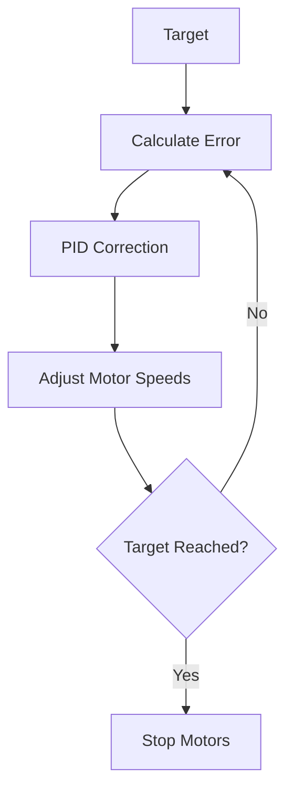
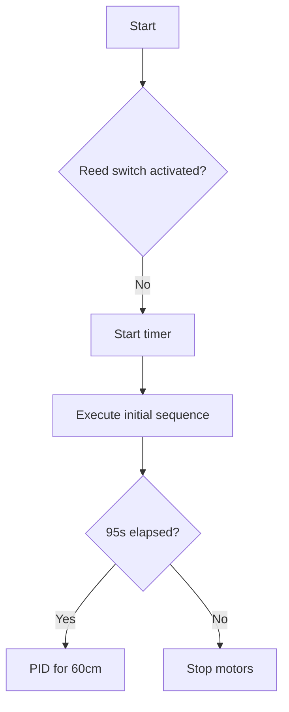

# 🤖 Documentation: Grand Robot Code

## 1. Introduction

This system controls an autonomous robot equipped with:
- DC motors with encoders for precise movement.
- Ultrasonic sensors to detect and avoid obstacles.
- A PID algorithm to correct trajectory errors in real time.
- Programmable sequences (startup, final movement).
- Signal sending for banner deployment.

🎯 **Goal**: Ensure precise movement over a defined distance, detect obstacles, and trigger a banner deployment.  
This system was tested on an Arduino Mega board, which communicated with **two additional Arduino Uno boards**:
- The **first Uno** managed all ultrasonic sensors and sent a HIGH signal to the Mega when an obstacle was detected.
- The **second Uno** handled the banner deployment, waiting for a signal from the Mega to activate it.

**Context**: This robot is designed to participate in the **Eurobots 2025** tournament. The code is therefore adapted to the layout and rules of that competition.

---

## 2. 📚 Required Libraries

### 1. Core Libraries

| Library              | Source / Installation                              | Role                                           |
|----------------------|----------------------------------------------------|------------------------------------------------|
| Adafruit_MotorShield | Available via Arduino IDE                          | Controls the motors via Adafruit motor shield  |
| ArduinoLog           | [GitHub](https://github.com/thijse/Arduino-Log.git)| Serial logging and debug output                |
| NewPing              | Available via Arduino IDE                          | Handles ultrasonic sensors (e.g. HC-SR04)      |
| LiquidCrystal_I2C    | Available via Arduino IDE                          | LCD display via I2C                            |

### 2. Dependencies (Auto-installed)

| Library    | Role                                       |
|------------|--------------------------------------------|
| Wire       | I2C communication (bundled with Arduino)   |
| Arduino.h  | Core Arduino definitions (always included) |

---

## 3. 🗂️ Code Structure

### Main Files

| File               | Role                                                               |
|--------------------|--------------------------------------------------------------------|
| `main.ino`         | Main loop, manages sequences and timing                            |
| `pid_control.cpp`  | PID algorithm implementation for motor distance correction         |
| `motor_control.cpp`| Motor driving logic (speed, direction) + `Stop()` function         |
| `encoder.cpp`      | Encoder pulse reading for distance estimation                      |
| `signal.cpp`       | Obstacle detection (`sensorMesure()`) and external signaling       |
| `constants.h`      | Pin assignments (encoders, signals, sensors, etc.)                 |
| `globals.h`        | Global variables (PID values, speeds, constants)                   |

---

## 4. ⚙️ Key Features

We'll go through each file to better understand how the system works. This will help you customize the logic to suit your own project. Relevant code snippets are included to illustrate key concepts.

---

### 1️⃣ `pid_control.cpp`

This file is critical. It ensures that the speed difference between both wheels is regulated using a PID controller by passing a **target distance** to the `pid()` function.

---

#### 🔧 Core Mechanism

1. **Initialization**  
   Reset encoder counters:
   ```cpp
   posi1 = 0;
   posi2 = 0;
   ```

2. **Control Loop**  
   Run while the traveled distance is less than the target:
   ```cpp
   while (abs(currentDistance) <= abs(target)) {
     ...
   }
   ```

3. **Calculations**
   - Traveled distance:
     ```cpp
     currentDistance = (posi / stepsPerRevolution) * wheelCircumference;
     ```
   - Error calculation:
     ```cpp
     error = target - currentDistance;
     ```

4. **PID Correction**  
   Apply gains using:
   ```cpp
   updateMotorPID(motor, error, kp, ki, kd, maxspeed);
   ```

> The `updateMotorPID()` function is defined in `motor_control.cpp`.

---

#### ⚙️ Motor Synchronization

```cpp
if (abs(error1 - error2) > 0) {
  adjustedSpeed1 = (error1 > error2) ? maxspeed * 0.8 : maxspeed * 0.9;
  adjustedSpeed2 = (error1 > error2) ? maxspeed * 0.9 : maxspeed * 0.85;
}
```

- If one motor is slower, it gets a speed boost to synchronize movement.

---

#### 🛑 Obstacle Handling

```cpp
if (sensorMesure()) {
  Stop();
  delay(6000);  // Safety delay
}
```

> The logic is straightforward but customizable. You may implement alternative reactions to obstacles instead of simply stopping.

---

#### 📊 PID Flow Diagram



---

### 2️⃣ `motor_control.cpp`

This file contains the configuration and control logic for both DC motors.

---

#### ⚙️ 1. Motor Initialization

```cpp
Adafruit_MotorShield AFMS = Adafruit_MotorShield();
Adafruit_DCMotor *myMotor1 = AFMS.getMotor(1); // Motor 1 on port M1
Adafruit_DCMotor *myMotor2 = AFMS.getMotor(2); // Motor 2 on port M2
```

- `AFMS`: Communication object for the Adafruit motor shield.
- `myMotor1` / `myMotor2`: Pointers to each motor object.

---

#### 🔧 2. Core Functions

---

##### 🛑 A. Stop Motors – `Stop()`

```cpp
void Stop() {
  myMotor1->run(RELEASE);
  myMotor2->run(RELEASE);
}
```

- **Action**: Disables both motors by releasing them.
- **Usage**: Used in emergency stops or when completing a movement.

---

##### ↩️ B. Rotate Robot – `rotate()`

```cpp
void rotate(int durationMs, bool toLeft) {
  if (toLeft) {
    myMotor1->run(BACKWARD); // Left motor backward
    myMotor2->run(FORWARD);  // Right motor forward
  } else {
    myMotor1->run(FORWARD);  // Left motor forward
    myMotor2->run(BACKWARD); // Right motor backward
  }
  delay(durationMs);
  Stop();
  posi1 = posi2 = 0; // Reset encoder counts
}
```

- `durationMs`: Duration of the rotation (in ms).
- `toLeft`: `true` to rotate left, `false` to rotate right.
- **Effect**: Spins the robot on the spot.

---

##### 🧠 C. PID Motor Control – `updateMotorPID()`

```cpp
void updateMotorPID(Adafruit_DCMotor *motor, float error, float kp, float ki, float kd, float maxspeed) {
  static float integral = 0.0;
  static float lastError = 0.0;
  
  integral += error;
  float derivative = error - lastError;
  float output = kp * error + ki * integral + kd * derivative;
  motor->setSpeed(constrain(abs(output), 0, maxspeed));
  lastError = error;
}
```

- `error`: Distance to target.
- `kp`, `ki`, `kd`: PID coefficients.
- `maxspeed`: Speed limit (0–255).
- **Purpose**: Smoothly adjust the motor speed using PID feedback, as taught in control theory.

---

#### 🧪 3. Example Usage

```cpp
// Rotate left for 1 second
rotate(1000, true);

// Apply PID to motor 1 (error = 2.5 cm, max speed = 200)
updateMotorPID(myMotor1, 2.5, 80.0, 10.0, 1.0, 200);
```

---

### 3️⃣ `encoder.cpp`

This file handles **encoder readings** to measure the **position and speed** of the motors in real-time.

---

#### 🧾 1. Global Variables

```cpp
volatile int posi1 = 0; // Step count for Motor 1
volatile int posi2 = 0; // Step count for Motor 2
```

- `volatile`: Indicates that the variable can be changed inside an **Interrupt Service Routine (ISR)**.
- **Purpose**: Keeps track of the number of steps each encoder has detected since reset.

---

#### ⚡ 2. Interrupt Service Routines (ISRs)

**For Motor 1:**

```cpp
void readEncoder1() {
  int b = digitalRead(ENCB1);
  posi1 += (b > 0) ? 1 : -1;
}
```

**For Motor 2:**

```cpp
void readEncoder2() {
  int c = digitalRead(ENCB2);
  posi2 += (c > 0) ? 1 : -1;
}
```

---

#### ⚙️ How It Works

1. Each ISR reads the state of the second encoder pin (ENCB).
2. Based on that state, the function increments or decrements the position counter (`posi1` or `posi2`).

> 📌 The encoder pins (`ENCA1`, `ENCB1`, `ENCA2`, `ENCB2`) are defined in `constants.h`.

---

### 4️⃣ `signal.cpp`

This file manages **obstacle detection** and **external communication** between the robot and other Arduino boards (such as the one controlling the banner).

---

#### ⚙️ 1. Global Configuration

```cpp
bool ultrasonicsActive = true;  // Master switch for obstacle detection
```

- **Role**: Enables or disables ultrasonic detection globally.
- **Default value**: `true` (detection enabled).

---

#### 📤 2A. Sending a Signal – `sendSignal()`

```cpp
void sendSignal() {
  digitalWrite(SIGNAL_PIN2, HIGH);  // Send signal
  delay(50);                        // 50 ms pulse
  digitalWrite(SIGNAL_PIN2, LOW);   // End pulse
  delay(10000);                     // Wait 10 seconds
}
```

- Sends a **50 ms pulse** on `SIGNAL_PIN2` to notify the **banner-deploying Arduino**.
- Waits **10 seconds** to allow the banner to fully deploy.
- Pin definitions are found in `constants.h`.

---

#### 🧭 2B. Obstacle Detection – `sensorMesure()`

```cpp
bool sensorMesure() {
  if (!ultrasonicsActive) return false;

  if (digitalRead(SIGNAL_PIN) == HIGH) {
    return true;  // Obstacle detected
  }
  return false;   // No obstacle
}
```

- **Logic**:
  - Reads the digital state of `SIGNAL_PIN`.
  - A separate Arduino (with ultrasonic sensors) sends a `HIGH` signal when an obstacle is detected.

> 📌 `SIGNAL_PIN` and `SIGNAL_PIN2` are both defined in `constants.h`.

---

### 5️⃣ `sequence.cpp`

This file orchestrates the robot’s **autonomous movements** depending on the starting zone (blue or orange).

---

#### 🧩 1. Global Structure

```cpp
extern LiquidCrystal_I2C lcd;       // LCD screen access
extern bool ultrasonicsActive;      // Obstacle detection control
```

- These are **external variables**, shared from other modules.
- `lcd`: Used to display information (like score).
- `ultrasonicsActive`: Controls whether sensors are enabled during the sequence.

---

#### 🧠 2. Main Function: `executeInitialSequence()`

```cpp
void executeInitialSequence(bool isBlueZone)
```

- `isBlueZone`: `true` if the robot starts in the blue zone, `false` for the orange zone.

---

#### 🔁 Sequence Logic

1. **Initialization**:
   - Temporarily disables ultrasonic sensors:
     ```cpp
     ultrasonicsActive = false;
     ```
   - Displays a fixed score (for example purposes):
     ```cpp
     lcd.print("Score : 20");
     ```

2. **Motion Sequence**:
   - Move forward/backward depending on the zone:
     ```cpp
     pid(isBlueZone ? 14.0 : -14.0);
     ```
   - Rotate with a zone-specific duration:
     ```cpp
     rotate(isBlueZone ? 1100 : 1350, true);
     ```

3. **Banner Signal**:
   - Trigger three signals to deploy the banner:
     ```cpp
     sendSignal();
     sendSignal();
     sendSignal();
     ```

---

#### 🛠️ Customize Your Sequence

You can design your own movement routine by combining:
- `pid(distance)` – forward/backward movement.
- `rotate(duration, direction)` – turning left/right.
- `sendSignal()` – banner deployment or external communication.

---

### 6️⃣ `globals.cpp`

This file acts as a **central hub** for all configurable parameters in the system. It allows for easy tuning of the robot's behavior.

---

#### 🎚️ 1. PID Parameters

```cpp
// Motor 1
float kp1 = 80.0;  // Proportional gain
float ki1 = 10.0;  // Integral gain
float kd1 = 1.0;   // Derivative gain

// Motor 2
float kp2 = 80.0;
float ki2 = 10.0;
float kd2 = 1.0;
```

- These values define the **PID control behavior** of each motor.
- The current values are standard defaults, but you should **tune them experimentally** for your own robot.

---

#### 🚀 2. Maximum Speed

```cpp
float maxspeed = 130;  // Range: 0–255
```

- Limits the PWM speed output to motors.
- Used to cap the robot’s top speed for better control.

---

#### 🧮 3. Physical Constants

```cpp
extern const float stepsPerRevolution = 1400.0;  // Encoder steps per wheel revolution
extern const float wheelDiameter = 6.8;          // Wheel diameter in cm
extern const float wheelCircumference = PI * wheelDiameter;
```

These constants are used to **translate encoder steps into real-world distance**.

🛠️ **Calibration steps**:
1. Measure the actual diameter of your wheels.
2. Count how many steps your encoder produces for a full wheel rotation.

---


### 7️⃣ `constants.cpp`

This header file serves as a **central reference** for all hardware-related constants, especially **pin assignments**.

---

#### 🧷 Encoder Pins

```cpp
#define ENCA1 2   // Encoder A for Motor 1
#define ENCB1 3   // Encoder B for Motor 1
#define ENCA2 19  // Encoder A for Motor 2
#define ENCB2 18  // Encoder B for Motor 2
```

- These pins must match your hardware wiring.
- They are used by the encoder interrupt routines to measure wheel rotation.

---

#### 🔁 Zone Selection Switch

```cpp
#define SWITCH_PIN 8  // Limit switch
```

- Used to **select the starting zone** (blue or orange) before the match begins.
- Read in `main.ino` to determine the correct sequence.

---

#### 📡 Signal Pins

```cpp
#define SIGNAL_PIN 7     // Input: Obstacle detection signal
#define SIGNAL_PIN2 13   // Output: Banner trigger signal
```

- `SIGNAL_PIN`: Receives `HIGH` from the **ultrasonic Arduino** when an obstacle is detected.
- `SIGNAL_PIN2`: Sends `HIGH` to the **banner-deploying Arduino** to trigger deployment.

---


### 8️⃣ `main.ino`

This is the **main control file** that ties all modules together. It handles initialization, timing, and controls the overall sequence of execution.

---

#### 🏗️ 1. System Initialization

---

##### 🔌 A. `setup()` – Hardware and Peripheral Configuration

```cpp
void setup() {
  // Serial and logging initialization
  Serial.begin(9600);
  Log.begin(LOG_LEVEL_VERBOSE, &Serial);

  // Pin configuration
  pinMode(ENCA1, INPUT);               // Encoder pin
  pinMode(REED_PIN, INPUT_PULLUP);     // Start pull switch

  // LCD and motor shield
  lcd.init();
  AFMS.begin();

  // Encoder interrupts
  attachInterrupt(digitalPinToInterrupt(ENCA1), readEncoder1, RISING);
}
```

- Logging is set to `VERBOSE` for debug output.
- Encoder interrupts are essential for accurate motion tracking.

---

##### 📦 B. Global Variables

```cpp
bool start = false;                         // Start flag
unsigned long startTime;                   // Timer
LiquidCrystal_I2C lcd(0x27, 16, 2);        // LCD display
```

- `start` is used to mark when the match begins and trigger the timer.

---

#### 🔁 2. Main Logic Loop – `loop()`

---

##### 🎯 A. Start Detection via Reed Switch

```cpp
int proximity = digitalRead(REED_PIN);  // Check if magnet is present

if (proximity == LOW) {
  Log.notice("Magnet detected. Waiting...");
} else {
  if (!start) {
    startTime = millis();  // Start the timer
    start = true;
  }
}
```

- Activated by removing a **magnet pull switch** (REED sensor).
- Triggers the beginning of the autonomous logic.

---

##### 🧠 B. Sequence Execution

```cpp
if (!initialSequenceCompleted) {
  executeInitialSequence(switchState == LOW);
  initialSequenceCompleted = true;
}

if (!endSequenceExecuted && millis() - startTime >= 95000) {
  pid(60); // Final movement
  endSequenceExecuted = true;
}
```

- Two main phases:
  1. **Initial sequence**: Executed once at match start.
  2. **Final sequence**: Executed after 95 seconds, e.g., to enter the parking zone.

---

#### 🖼️ Execution Flow Diagram


